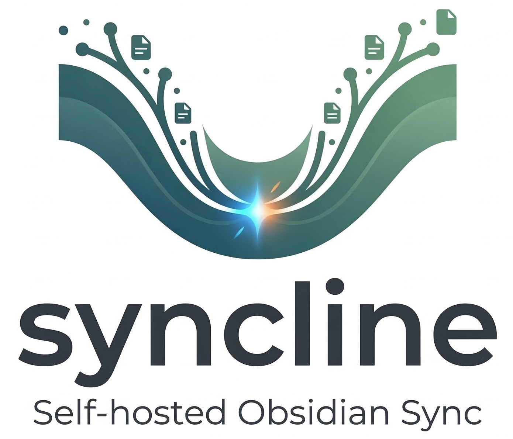

<p align="center">
  
</p>

<p align="center">
  <strong>Vault Sync You Actually Own.</strong>
</p>

<p align="center">
  <a href="https://opensource.org/licenses/MIT"></a>
  
  <a href="https://www.rust-lang.org/"></a>
  <a href="https://obsidian.md/"></a>
  
</p>

<br/>

<p align="center">
  <b>Keep your vault in sync across all devices.</b><br>
  No subscriptions • No cloud lock-in • No third-party servers
</p>

<p align="center">
  <i>You run the server. You own the data. It <b>just works</b>.</i>
</p>

<br/>

<p align="center">
  <a href="#installation">Installation</a> •
  <a href="#key-features">Features</a> •
  <a href="#how-it-works">How It Works</a> •
  <a href="#frequently-asked-questions">FAQ</a>
</p>

<hr/>

## Why Syncline?

Most sync solutions for Obsidian ask you to trust a third party with your notes. Syncline is different:

|                           | Syncline | Obsidian Sync | iCloud / Dropbox |
| ------------------------- | -------- | ------------- | ---------------- |
| **You own the data**      | ✅       | ❌            | ❌               |
| **Self-hosted**           | ✅       | ❌            | ❌               |
| **Works offline**         | ✅       | ✅            | Partial          |
| **No conflict dialogs**   | ✅       | ❌            | ❌               |
| **Binary file sync**      | ✅       | ✅            | ✅               |
| **Single-file database**  | ✅       | ❌            | ❌               |
| **Subscription required** | ❌       | ✅            | ✅               |

---

## Key Features

### 🔒 Privacy-First

Your notes never leave your infrastructure. The Syncline server runs on hardware you control — a home server, a VPS, a Raspberry Pi. No telemetry, no analytics, no third-party access.

### 📁 Single-File Server Storage

All vault data is stored in a single SQLite database file on your server. Backup is as simple as copying one file. No complex database administration required.

### ⚡ Fast & Lightweight

Built in Rust, the server is extremely efficient. It uses WebSockets for real-time communication, meaning changes appear on your other devices within milliseconds of saving.

### ✈️ True Offline Mode

Work without an internet connection for hours, days, or weeks. When you reconnect, Syncline automatically merges all changes from all devices — no manual conflict resolution needed.

### 🤝 No Conflict Dialogs — Ever

Syncline uses **CRDTs** (Conflict-free Replicated Data Types), the same technology powering collaborative editors like Notion and Figma. When two devices edit the same note simultaneously, the changes are merged mathematically. You will never see a "conflict file" for text edits.

### 🖼️ Binary File Synchronization

Images, PDFs, attachments — all synchronized. Binary files use a content-addressed storage system. If two devices modify the same binary file while offline, both versions are preserved with distinct names so nothing is lost.

---

## How It Works

```
  Your Laptop          Your Server          Your Phone
  (Obsidian)           (Syncline)           (Obsidian)
      │                    │                    │
      │── edit note ──────►│                    │
      │                    │── push update ────►│
      │                    │                    │
      │   (go offline)     │   (go offline)     │
      │── edit note A      │                    │── edit note A
      │                    │                    │
      │   (reconnect) ────►│◄─── (reconnect) ───│
      │                    │                    │
      │◄── merged A+B ─────┤──── merged A+B ───►│
      │   (no conflicts!)  │                    │
```

The server stores a compact history of changes. When you reconnect after being offline, it sends you exactly what changed — and merges your local edits automatically.

---

## Installation

### Step 1: Run the Syncline Server

The easiest way to run the server on your PC or Mac is to use the native **Syncline Desktop App**. It runs silently in your system tray, manages the database for you, and securely provides the connection URLs you need.

**Download the latest installer from the [Releases Page](https://github.com/tomas789/syncline/releases):**

- **Mac:** Download the `.dmg`
- **Windows:** Download the `.msi` or `.nsis.zip`

Once installed, it will automatically start with your computer. Just click the Syncline menu bar icon and select **Start Server**!

---

**Advanced/CLI Users:**
If you prefer to run the standalone headless CLI (e.g., on a headless Linux VPS or Raspberry Pi):

```bash
# Download the unified CLI binary from Releases, or build from source:
cargo run -- server --port 3030 --db-path ./syncline.db
```

### Step 2: Install the Plugin

**Option A — Community Plugins (recommended)**

1. Open Obsidian → Settings → Community Plugins
2. Search for **Syncline**
3. Click Install, then Enable

**Option B — Manual Installation**

1. Download `main.js`, `manifest.json`, and `styles.css` from the [latest release](https://github.com/tomas789/syncline/releases)
2. Copy them to `<your-vault>/.obsidian/plugins/syncline-obsidian/`
3. Reload Obsidian and enable the plugin in Settings → Community Plugins

### Step 3: Connect

1. Open Settings → Syncline
2. Enter your server URL (e.g. `ws://192.168.1.100:3030/sync` or `wss://sync.yourdomain.com/sync`)
3. Click **Connect**

Your vault will begin syncing immediately. Install the plugin on your other devices and point them to the same server.

---

## Frequently Asked Questions

**Do I need to keep the server running all the time?**
No. The server stores all changes durably in SQLite. If the server is offline when you make edits, your changes are queued locally and synced automatically the next time the server is reachable.

**What happens if I edit the same note on two devices while offline?**
Both sets of changes are preserved and merged automatically using CRDTs. You will never lose a character you typed.

**What about images and attachments?**
Binary files are fully supported. They are synchronized using content-addressed storage. If two devices modify the same binary file concurrently, both versions are kept (with distinct names) so nothing is lost.

**Is my data encrypted?**
Data is transmitted over WebSockets. For encryption in transit, put the server behind a reverse proxy with TLS (e.g., Nginx + Let's Encrypt). End-to-end encryption support is planned.

**How do I back up my data?**
Copy the `syncline.db` file from your server. That single file contains the complete history of your vault.

**Can I use this on mobile?**
Yes. The plugin works on both desktop and mobile Obsidian.

---

## Repository

- **Main repository:** [github.com/tomas789/syncline](https://github.com/tomas789/syncline)

---

## License

MIT
